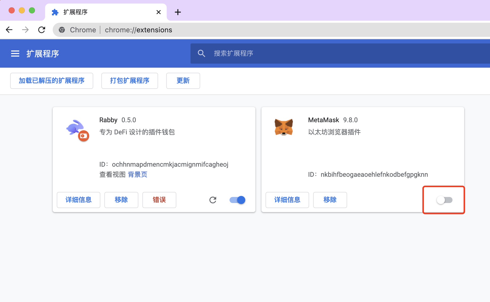

# Resolving conflicts caused by MetaMask

If you have MetaMask installed in your browser, we recommend that you temporarily disable MetaMask in order to avoid possible conflicts during the use of Rabby.
Disabling MetaMask does not delete any data you have stored in it. You can enable MetaMask again at any time.

## Settings in Chrome

1. Open the extensions page: [chrome://extensions](chrome://extensions)
2. Find MetaMask and click the switch button in the bottom right corner to disable it.
3. If any dapp website is opened, refresh the website.

---

Firefox/Edge/Brave version of Rabby will be available soon.